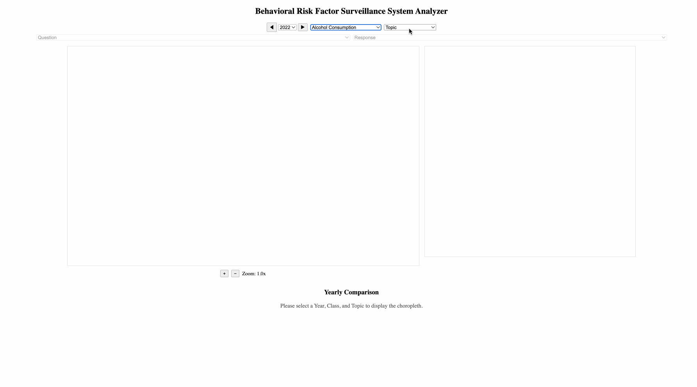

# Behavioral Risk Factor Surveillance System Analyzer

## Project Title

Behavioral Risk Factor Surveillance System (BRFSS) Visualizer

## Project Demo

  
_(Above: Example interaction with the map, filters, and charts.)_

## Screenshot of the Project Framework


## Group Member

- Valerii Zhurylo

## How to Run the Project

1. **Deployment:**  
   [https://zhurylo.github.io/cis-568/](https://zhurylo.github.io/cis-568/)

2. **Local setup** (if you want to run it locally):
   - Clone the repository.
   - Run:
     ```bash
     npm install
     npm run dev
     ```
   - Open your browser at [http://localhost:5173/](http://localhost:5173/) (or the port shown in your terminal).

## How to Read the Visualization

### Filter Controls

- **Year, Class, Topic, Question, Response** dropdowns let you filter the dataset.
- After selecting all options, the map and charts update.

### Map (Choropleth)

- **Color intensity** represents the selected health measure value (e.g., prevalence of screening).
- Darker colors = higher values, lighter colors = lower values.
- Hover over a state to see its exact value.
- Click on up to two states to compare their trends over years.

### Bar Chart

- Shows all states sorted by their selected health measure value (descending).
- **X-axis**: Value (e.g., % screened).
- **Y-axis**: State names.

### Line Chart (Yearly Comparison)

- After selecting two states, a line chart shows how their values changed **over years**.
- **X-axis**: Year
- **Y-axis**: Health measure value

## Visualization Idioms Explained

- **Choropleth Map**: Maps states to color intensity based on health measure value.
- **Bar Chart**: Ranks states by health measure values for easy comparison.
- **Line Chart**: Shows trends over time for selected states.
- **Interactive Controls**: Allow users to filter and explore different aspects of the BRFSS dataset.

## Data Source

- **Name:** Behavioral Risk Factor Surveillance System (BRFSS) Age-Adjusted Prevalence Data (2011 to present)
- **Data Sources:**
  - [Healthdata.gov - Behavioral Risk Factor Surveillance System (BRFSS)](https://healthdata.gov/dataset/Behavioral-Risk-Factor-Surveillance-System-BRFSS-A/m7ww-jcmt/about_data)
  - [Data.cdc.gov - Behavioral Risk Factor Surveillance System (BRFSS)](https://data.cdc.gov/Behavioral-Risk-Factors/Behavioral-Risk-Factor-Surveillance-System-BRFSS-A/d2rk-yvas/about_data)
- **Description:**  
  The BRFSS dataset collects state-level data about U.S. residents regarding their health-related risk behaviors, chronic health conditions, and use of preventive services.  
  The data used for this project covers multiple years from 2011 to the present and includes age-adjusted prevalence estimates across different health measures for all 50 U.S. states.
